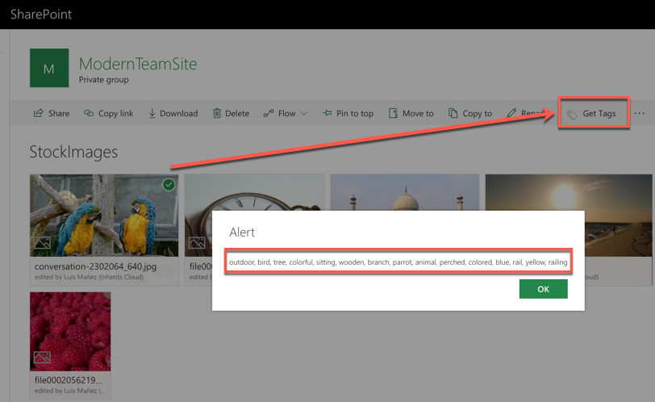

# Image Metadata from Cognitive Services Vision API List View Command Set

## Summary
Custom Command Set that gets metadata information from MS Cognitive Services Vision API for the selected Image



## Used SharePoint Framework Version


## Applies to

* [SharePoint Framework Extensions Developer Preview](https://dev.office.com/sharepoint/docs/spfx/extensions/overview-extensions)
* [Office 365 developer tenant](http://dev.office.com/sharepoint/docs/spfx/set-up-your-developer-tenant)

## Solution

Solution|Author(s)
--------|---------
react-command-vision-api|Luis Mañez (MVP, [ClearPeople](http://www.clearpeople.com), @luismanez)

## Version history

Version|Date|Comments
-------|----|--------
1.0.0|September 30, 2017|Initial release
2.0.0|November 11, 2017|Image model and React component

## Disclaimer

**THIS CODE IS PROVIDED *AS IS* WITHOUT WARRANTY OF ANY KIND, EITHER EXPRESS OR IMPLIED, INCLUDING ANY IMPLIED WARRANTIES OF FITNESS FOR A PARTICULAR PURPOSE, MERCHANTABILITY, OR NON-INFRINGEMENT.**

---

## Prerequisites

* Office 365 Developer tenant with a classic site collection and a list of locations
* Cognitive Services API Key (more info [https://azure.microsoft.com/en-us/services/cognitive-services/](https://azure.microsoft.com/en-us/services/cognitive-services/))

## Minimal Path to Awesome

* clone this repo
* edit "ImageCognitiveMetadataCommandSet.ts" file to set your Cognitive Services API Key:

```ts
private cognitiveServicesKey: string = "COGNITIVE_SERVICES_API_KEY";
```

* in the command line run
  * `npm i`
  * `gulp serve-info --nobrowser`
* copy the list view command set debug query string parameters:

```
?loadSPFX=true&debugManifestsFile=https://localhost:4321/temp/manifests.js&customActions={"e109ab75-a728-418c-85c6-7430363e348d":{"location":"ClientSideExtension.ListViewCommandSet.CommandBar"}}
```
* in the web browser
  * navigate to the library with images (**note**: command only works with images. You will get an error if you try the command with any other file)
  * to the URL of the list add the previously copied debug query string parameters

## Features

Sample SharePoint Framework list view command set calling the Cognitive Services Vision API and showing the Tags extracted from the Image.

This sample illustrates the following concepts on top of the SharePoint Framework:

* using Vision API to get the image Tags
* how to get the download url of the selected file
* using async / await for the async calls


